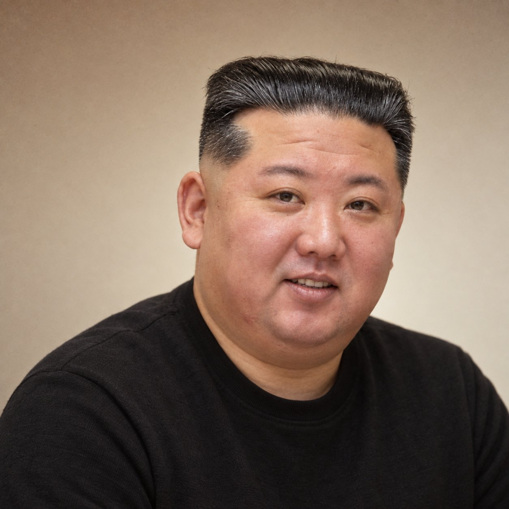

# GPT2 × 头像 × Tibo 同款 × 棕色 × A.001

- **日期**: 2026-09-15
- **来源**: [@xiaoxiaodong01](https://x.com/xiaoxiaodong01/status/2099758539665490371)
- **Tweet ID**: `2099758539665490371`
- **模型**: GPT Image 2 (ChatGPT 网页版)
- **备注**: 复刻 Tibo 风格亲和头像的可复制提示词，含成片对照。

## 成片




## 提示词

```
基于输入照片生成真实、自然、亲和的专业头像，高度保持人物身份一致性、五官比例、脸型、发际线、年龄感与原有性别表达，不改变长相。1:1方形构图，胸部以上取景，采用非对称视觉平衡：人物略偏右，头顶保留约18%画面高度，左侧与左上形成主要负空间，避免证件照式居中和紧裁切。肩线自然，头部轻微侧倾，直视镜头，表情放松、自信、友善，可自然微笑或露齿笑。

服装采用简洁深色圆领或极简上装，根据人物原有风格自然适配；女性保留自然发型、妆容与适量首饰，男性保留胡茬、发型等真实特征，不做刻板性别化造型。背景为真实暖色墙面：顶部低明度红棕/焦糖暖灰，中部灰米杏，下部奶油米白，由自然光衰减、墙面反射和轻微暗角形成非线性纵向渐变；加入细小、低幅度、高频随机颗粒，暗部略明显，模拟早期数码传感器与轻微JPEG质感。

使用大面积柔和窗光，低光比、低局部对比，无轮廓光和商业棚拍塑形。肤色保持真实色相差异与自然血色，女性避免瓷白磨皮，男性避免过度强调粗糙纹理；降低高频皮肤细节与clarity，保留中低频面部结构，使皮肤柔和但真实。整体低饱和暖调、柔和高光、轻微抬黑、减少蓝青色，呈现2000s–2010s早期数码头像质感：聪明、可信、轻松、自然、有亲和力，而非现代高端商业肖像。
```

## 归属

原文与成图来自 [@xiaoxiaodong01](https://x.com/xiaoxiaodong01)（小小东）。本仓库仅作个人归档，不主张原创权。
