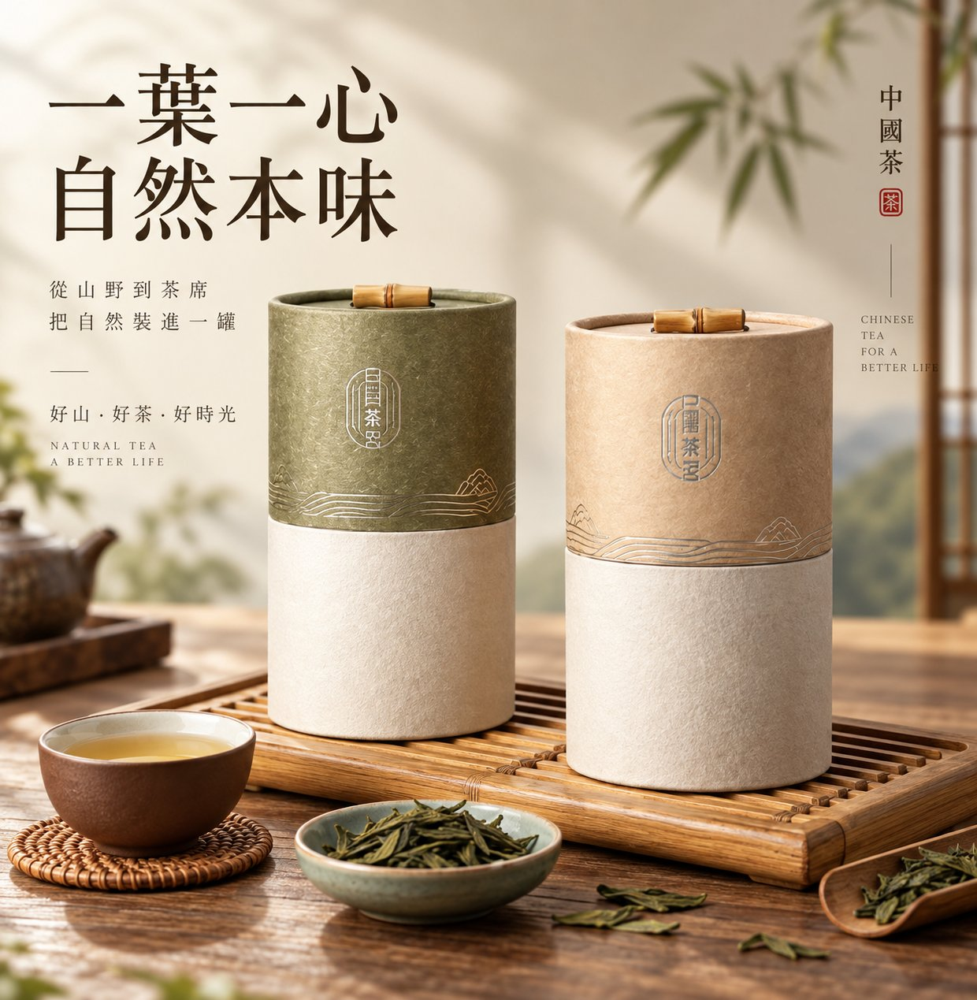
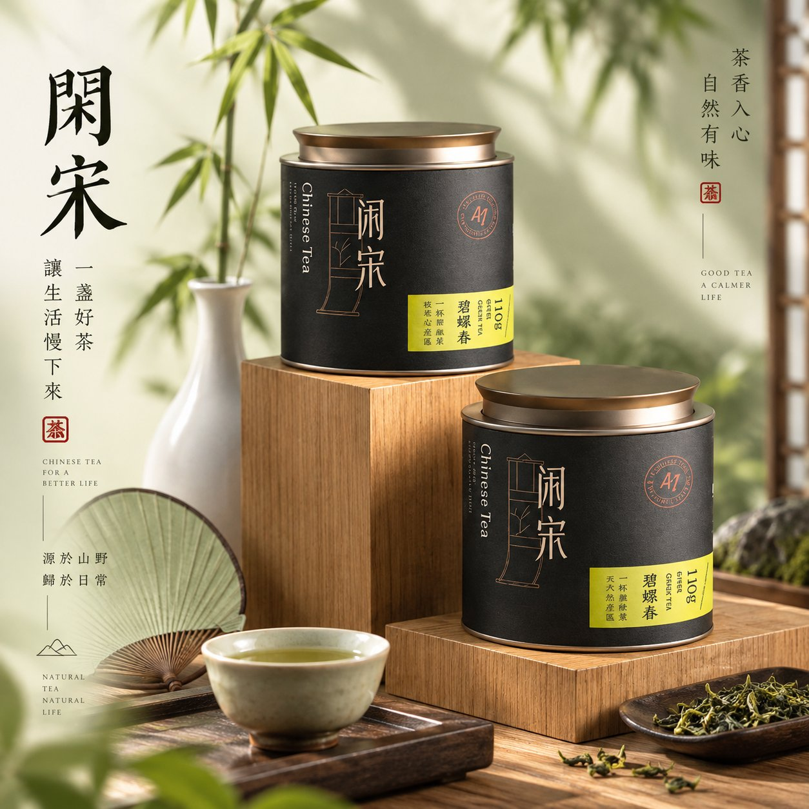

# GPT2 × 点上 × 产品主图 × 尝试

- **日期**: 2026-09-17
- **来源**: [@xiaoxiaodong01](https://x.com/xiaoxiaodong01/status/2100599522460365258)
- **Tweet ID**: `2100599522460365258`
- **模型**: GPT Image 2.5
- **备注**: 电商产品主视觉提示词；支持产品实拍参考或纯文案命题，强调真实材质、接触阴影与品牌级主图气质。

## 成片




## 提示词

```
高级商业产品主视觉摄影。

首先判断输入方式：

若用户提供产品实拍图、包装图或商品参考图，以原产品为最高优先级视觉依据。准确保留产品的造型、比例、结构、包装、品牌标识、文字位置、颜色、材质、纹理及关键识别特征，不擅自改款、重新设计或替换商品。可以根据新场景自然重建光线、阴影、反射、透视与环境色，使原产品真正融入画面，而不是简单贴图。若原图背景杂乱，可自然提取主体并重新建立空间。

若用户只提供产品名称、品类或创意命题，则根据产品属性、功能、材质、消费情境与品牌气质建立合理的商品形态及视觉世界，不机械套用既定模板。

画面从商品自身向外生长。主体清晰、真实、有重量，表面纹理、边缘和材质具有可信触感；商品自然落在与其气质相呼应的承载基面、台面或结构关系中，形成明确重心与接触阴影，避免悬浮感和模板化展台。

前景与周围只出现真正能够解释商品的器物、原料、材质或细节，疏密自然；背景保持克制，可通过柔和渐变、低对比轮廓、自然投影、模糊形态、纹理或若隐若现的主题意象建立空间，让环境像商品气质留下的余韵，而不是直接堆砌主题元素。

光线具有明确方向，但保持柔和自然。重点塑造商品体积、材质、边缘和重量，明暗过渡细腻，亮部有空气，暗部保留层次，底部拥有真实的接触阴影；让光真正作用于商品，而不是平均照亮整个画面。

色彩从商品本身延展，背景、基座、道具和环境色自然呼应，允许细微冷暖、明暗与材质变化，不使用机械配色公式。

若需要标题，大字必须成为商品之外最明确的视觉核心之一：尺度大胆、字形完整、轮廓清楚、阅读清晰，在缩小画面后仍能迅速识别；不让纹理、插画或复杂背景穿过主要字形。辅助文字、英文、编号和说明自然退后，形成精致的编辑层级。

整体高级、安静、真实、有空气感，丰富但不过满，元素之间彼此牵引而非人为堆积。避免商品变形、包装文字乱改、品牌元素丢失、漂浮主体、廉价展台、机械对称、无意义装饰、平均打光、背景抢戏及模板化电商感。

最终呈现成熟品牌级电商主图、产品海报或品牌KV。
```

## 归属

原文与成图来自 [@xiaoxiaodong01](https://x.com/xiaoxiaodong01)（小小东）。本仓库仅作个人归档，不主张原创权。
