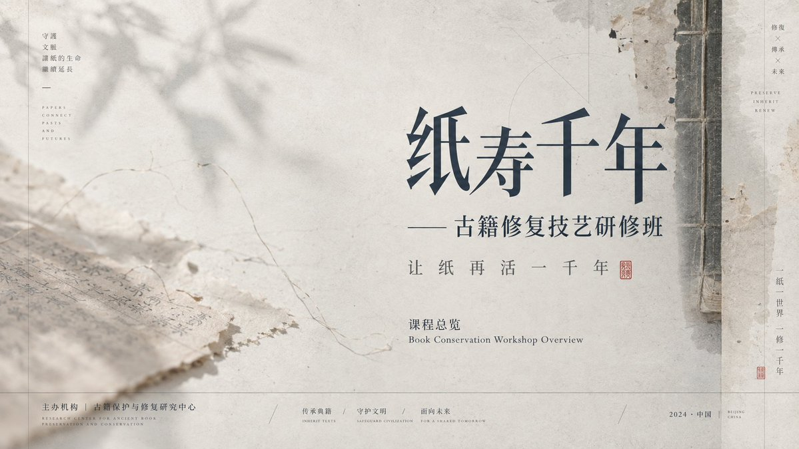
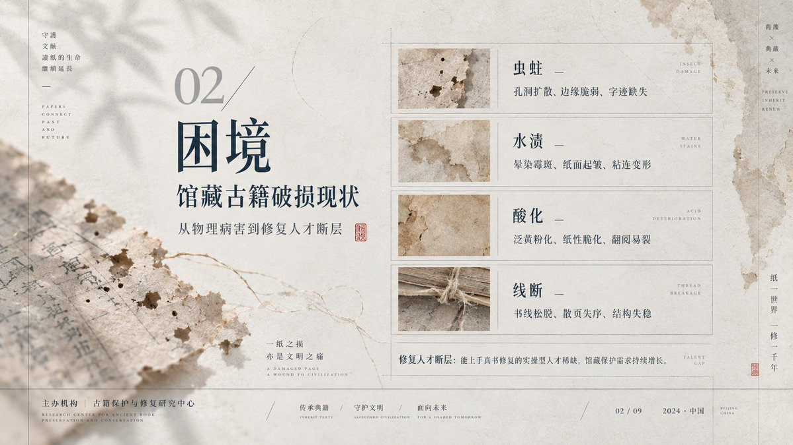
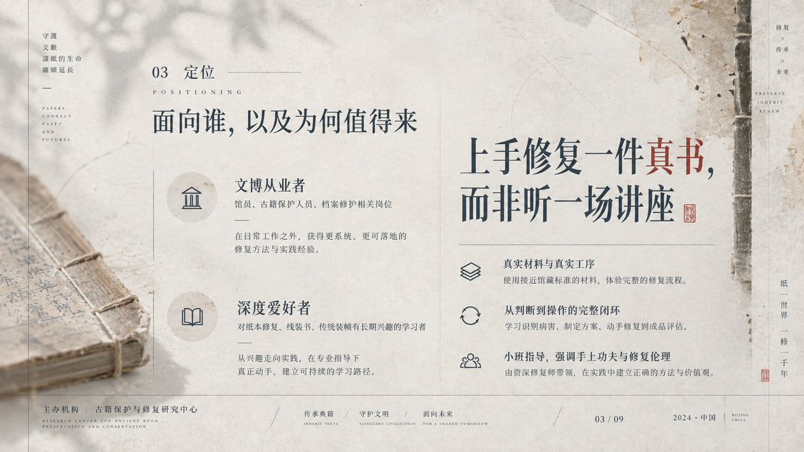
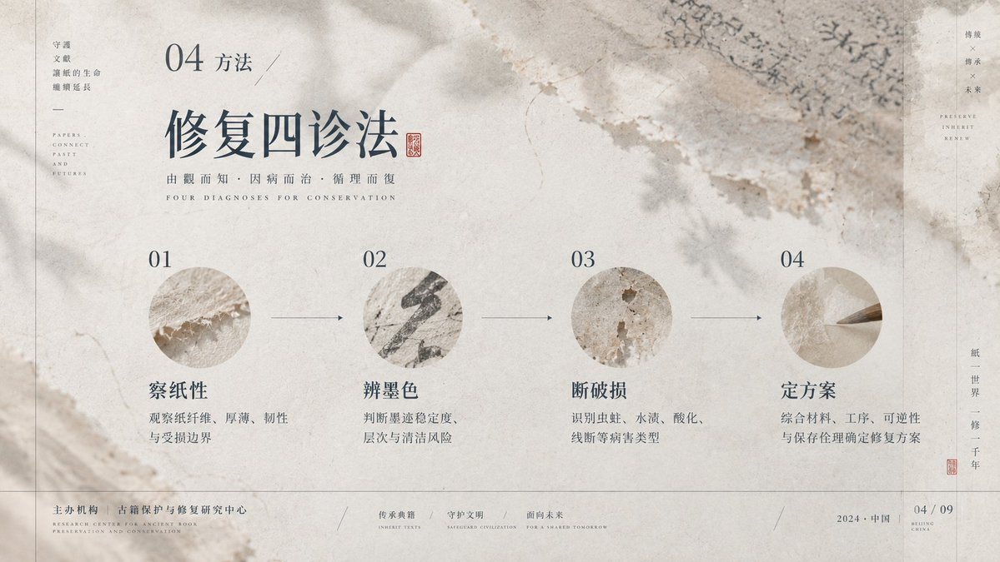

# 语文老师国风 PPT 汤底提示词

- **日期**: 2026-09-18
- **来源**: [@xiaoxiaodong01](https://x.com/xiaoxiaodong01/status/2100860468583682322)
- **Tweet ID**: `2100860468583682322`
- **模型**: GPT Image 2.5
- **备注**: 国风克制 PPT 视觉系统汤底；负空间、纸面影像感与网格秩序，配套成片见同帖及 part 2 / PPT 续帖。

## 成片






## 提示词

```
以负空间叙事和纸面影像感建立克制PPT视觉系统，主导理论为格式塔连续性、动态平衡、模块网格与基线节奏：用连续性组织细线、投影与文字的缓慢阅读，用不等量配重让大片空场与一侧高密结构互相牵制，用网格约束信息栏、标题、注释与页脚的对齐。借鉴穆勒-布罗克曼的理性网格控制边距、栏宽和小字号秩序，借鉴布罗多维奇的编辑留白与图文呼吸制造停顿，借鉴田中一光的文化符号几何化方法把装饰转成平面结构，借鉴阿尔伯斯的邻接感知维持低彩度层次。配色只定义角色：背景为最高面积的低彩度高明度承载层，结构线和正文为低明度信息层，半透明影像为中明度氛围层，少量强调信息以更强明度差出现，面积约7:2:1；未来主题配色按角色一键映射，必须保留明度顺序、低彩度、透明叠压和投影可读性。版式采用偏轴模块网格，空场占主导，内容叙事决定标题靠空场内侧、信息列表沿安静轴线排列、焦点图形贴边或越界，唯一破格是细线或影像穿越栏线形成牵引。背景以纤维底材、淡化墨洗和摄影转印的层叠工艺构成，先铺吸收纹理，再叠模糊有机方向影、线性框架和细枝状引导线，边缘虚化、局部残旧、光照漫射。字体采用高反差显示字与低反差小字的对照配对，标题保留修长骨架、开放字腔、细锐收笔和宽松字距，正文以窄行距小字号形成精密注释，任意文字系统都按自身合法笔画、字腔、连结、标记和阅读方向重建同等密度与气息。情绪为含蓄、疏朗、静默、书卷、温润、秩序、余韵。
```

## 归属

原文与成图来自 [@xiaoxiaodong01](https://x.com/xiaoxiaodong01)（小小东）。本仓库仅作个人归档，不主张原创权。
