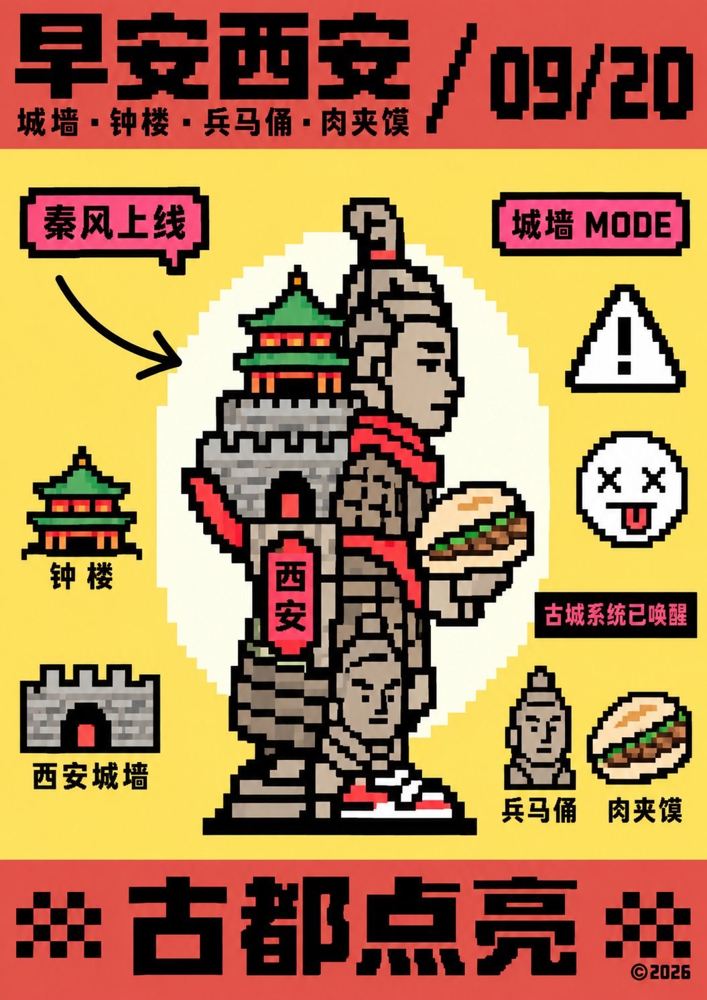
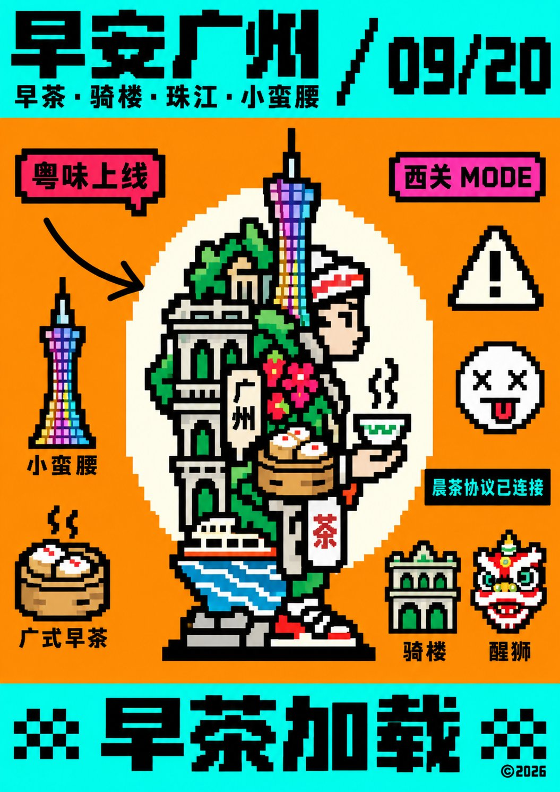
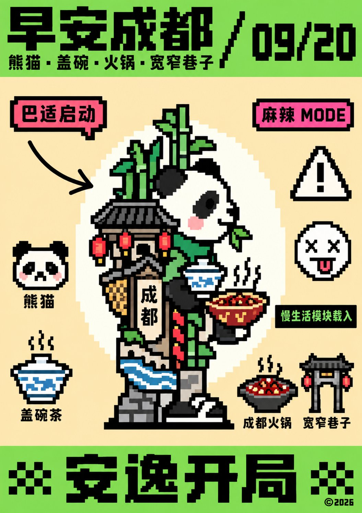
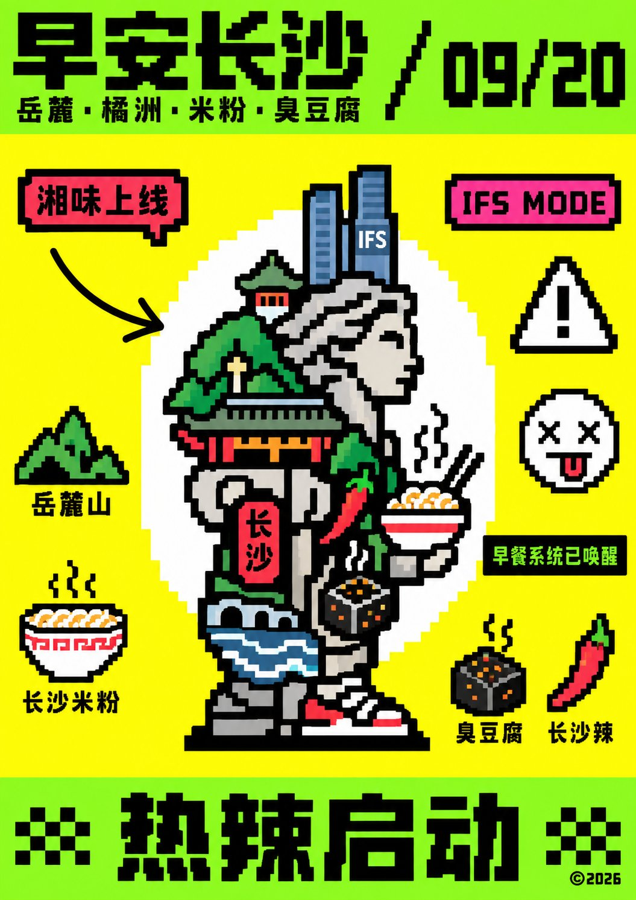

# GPT2 × 早安 × 像素 × 多城

- **日期**: 2026-09-20
- **来源**: [@xiaoxiaodong01](https://x.com/xiaoxiaodong01/status/2101475838411813086)
- **Tweet ID**: `2101475838411813086`
- **模型**: GPT Image 2
- **备注**: 像素操作系统状态屏汤底；固定荧光绿顶底条 + 酸黄视窗 + 中央像素图腾结构，主题只换城市语义与配色（长沙及补城）。作图记录：https://chatgpt.com/share/6aaf2f52-3320-83ea-9f96-57bb9757977d

## 成片






## 提示词

```
未来主题只替换图腾语义、栏内文案和贴纸含义，构造不变：先把主题核心压成侧面站立的粗像素图腾，再把说明拆成顶栏标题、日期戳、散落标签、警示符、表情贴和底栏标语，全部按操作系统状态屏的元数据贴附，不得铺成故事场景。第一眼必须是荧光绿顶底横条夹住整块酸黄视窗，中央一枚边缘呈像素台阶的浅白圆光托着厚黑描边低分辨率图腾，黄绿黑硬撞发振，读成钉在仪表盘上的系统图标。顶栏绿带内黑像素字分两级，左侧超粗主标题压更小副标题，右侧用粗斜杠切开日期数字；底栏绿带用加宽字距的超黑像素标语横贯，两侧各一枚小棋盘格，远端跟小号版权年号。黄场内图腾周围做贴纸式散点：红粉像素小标签、黄白三角感叹号、叉眼圆脸、一条黑底绿字短句块。全图只允许一条光滑手绘黑箭头划破网格指向图腾，它是唯一脱离像素矩阵的物体。字形与物象共用同一粗网格：笔画等粗一二格、端点方切、转角直角、斜向只走四十五度阶梯锯齿，字怀紧到单格，内白几乎实心，阅读沿顶栏从主标题到日期再落入中央图腾最后落到底栏标语。色料是荧光黄绿与酸黄大色块对撞纯黑线字，红粉只给次级标签，浅白只给圆光和三角内白，表面像早期显示器的硬边色块，无纸纹无印刷噪点无渐变釉。禁止抗锯齿、禁止渐变与写实体积、禁止精细生物解剖、禁止取消顶底绿条或把黄场画成风景。


——————
主题：早安长沙
注意：很多像素风格长沙文化和建筑、美食元素。

——————
更换城市成其他城市元素和配色方案， 一共补充5个城市

每个城市一张独立图片生成
```

## 归属

原文与成图来自 [@xiaoxiaodong01](https://x.com/xiaoxiaodong01)（小小东）。本仓库仅作个人归档，不主张原创权。
