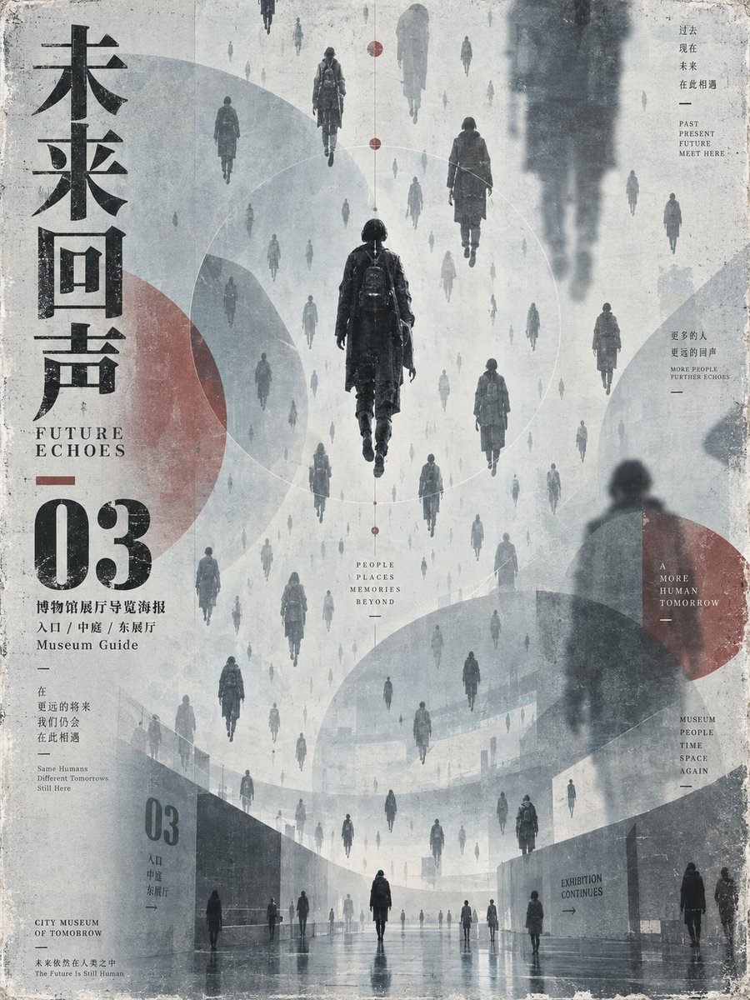

# GPT2 × 博物馆导览海报 × VCR

- **日期**: 2026-09-20
- **来源**: [@xiaoxiaodong01](https://x.com/xiaoxiaodong01/status/2101602734004953114)
- **Tweet ID**: `2101602734004953114`
- **模型**: GPT Image 2
- **备注**: 半透明重复主体漂浮的博物馆展厅导览海报汤底；雾白浅灰底 + 低饱和暗红导视块，竖版 3:4。作图记录：https://chatgpt.com/share/6aafa57b-af04-83ea-b179-e1cac45425c7

## 成片



## 提示词

```
让未来主题的核心对象以大量同形但尺度、清晰度与远近不同的身影或符号散布在整张画面中，形成第一眼就被感知的“单一主体无数次漂浮出现”事件：少数几个清晰主体承担叙事锚点，更多半透明、低对比、被裁切或隐入背景的重复形体制造无尽延展。采用冷淡的浅蓝灰、雾白、炭黑与低饱和暗红组成平静而略带不安的印刷色块，背景保持大面积留白，让重复对象像从墙面、天空或建筑表面生长出来。以几个巨大、半透明、边缘柔和的圆形或椭圆形遮罩压住图像与信息，使前后层次、远近关系和阅读路径互相穿插；清晰主体可跨越遮罩、地平线、墙体或版面边界，产生不合逻辑却克制的空间错位。文字不是装饰，而是与图像共享同一套扁平印刷墨色：标题使用宽窄反差明确、笔画厚薄富有节奏、收笔带轻微切削感、转折坚实、内空间清楚的展示性字形；字组沿主视觉轴排列，以大小、密度和遮挡建立层级，任何文字系统都须保持可识别的骨架、呼吸与阅读方向。整体像旧展览印刷品，保留轻微套印偏差、颗粒、褪色、纸面透底和边缘磨损，但不添加华丽渐变、镜面质感或过度清洁；光线均匀、阴影克制，反美化地维持平静、疏离、重复与偶发错位之间的张力。


——————
做成博物馆展厅导览海报：以雾白和浅灰为底，加入低饱和暗红几何导视块与深炭色主体，身影围绕中央垂直轴分层漂浮，中心清晰主体连接上下阅读路径，四周留出均衡呼吸区；标题沿左侧竖向对齐，使用中等字号主标题、粗体展区编号和细小说明的三级关系，圆形遮罩压过标题与人物；画幅为竖版 3:4。
```

## 归属

原文与成图来自 [@xiaoxiaodong01](https://x.com/xiaoxiaodong01)（小小东）。本仓库仅作个人归档，不主张原创权。
