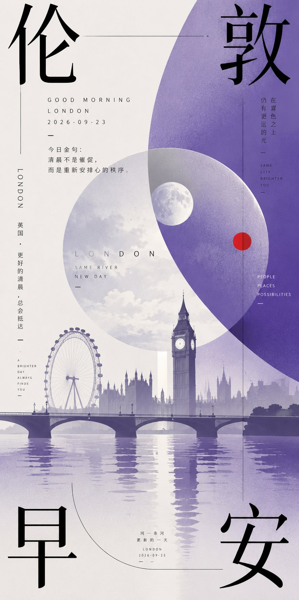
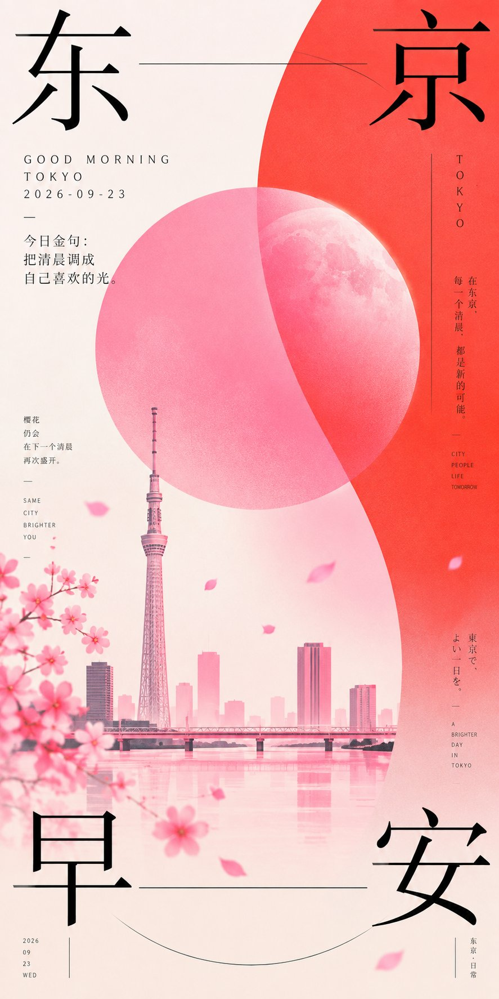
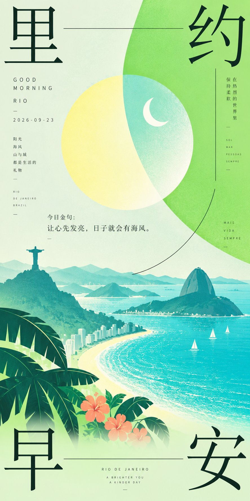
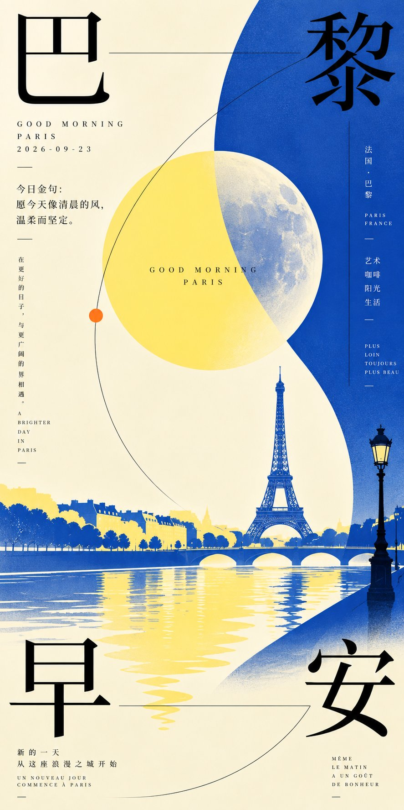

# GPT2 × 早安 × 几何 × 月 × 美学提示词 × 2026-09-23

- **日期**: 2026-09-23
- **来源**: [@xiaoxiaodong01](https://x.com/xiaoxiaodong01/status/2102549424153166056)
- **Tweet ID**: `2102549424153166056`
- **模型**: GPT Image 2
- **备注**: 东方现代平面：双色场 + 圆形主形 + 大字排版；十城早安金句壁纸练习。提示词取自推文指向的 [ChatGPT 分享](https://chatgpt.com/share/6ab316f5-a4ec-83e9-bdf2-cfa0bbcb67e6)。

## 成片






## 提示词

```
围绕任意主题对象生成一张东方现代平面视觉：画面先由两块高明度主题色场建立冲突与呼吸感，一块作为清透明亮的基础空间，一块以柔软弧形边界从侧面推进，形成强烈的图地张力；主题的核心象征被提炼成一个放大的纯粹圆形或近圆主形，悬在色场交界处，与背景发生透明叠压和局部吞没，让第一眼先读到色块、圆形和留白之间的压迫感，再读到文字。色彩从主题自身的季节、材质、情绪和文化语义中提取，保留大面积洁净底色、明亮而饱和的情绪主色、少量冷暖对置、极深信息色和细微颗粒阴影的角色关系，整体保持明亮轻快、清透干净、边界清晰，纹理只作为细腻印刷颗粒和柔和喷染层次，不让画面变脏变旧。文字是核心结构，不是装饰：使用极大字号的中文主题字分散压在画面边缘与角部，笔画细长克制，黑色高反差，字与字之间用极细横线、竖线和一条优雅弧线牵引，形成像仪式路径一样的阅读节奏；中部可放一组小型英文或拼音信息，字距拉开、重量很轻，旁侧加入窄小竖排微文案和日期式信息作为秩序锚点。整体构图保持大留白、少元素、高反差、强几何主形和精密排版并置，主题对象必须被抽象成色场、圆形符号、线性轨迹与文字层级之间的关系，避免写实堆叠和常规节庆插画。


——————
主题：城市元素+早安问候+2026-09-23+今日金句+月亮元素+地标元素
一共10个不同的国家城市，每个城市都是一个独立的美图
画幅1：2

每个图片， 不同的配色逻辑、构图差异，一眼就是不同的色相
```

## 归属

原文与成图来自 [@xiaoxiaodong01](https://x.com/xiaoxiaodong01)（小小东）。本仓库仅作个人归档，不主张原创权。
