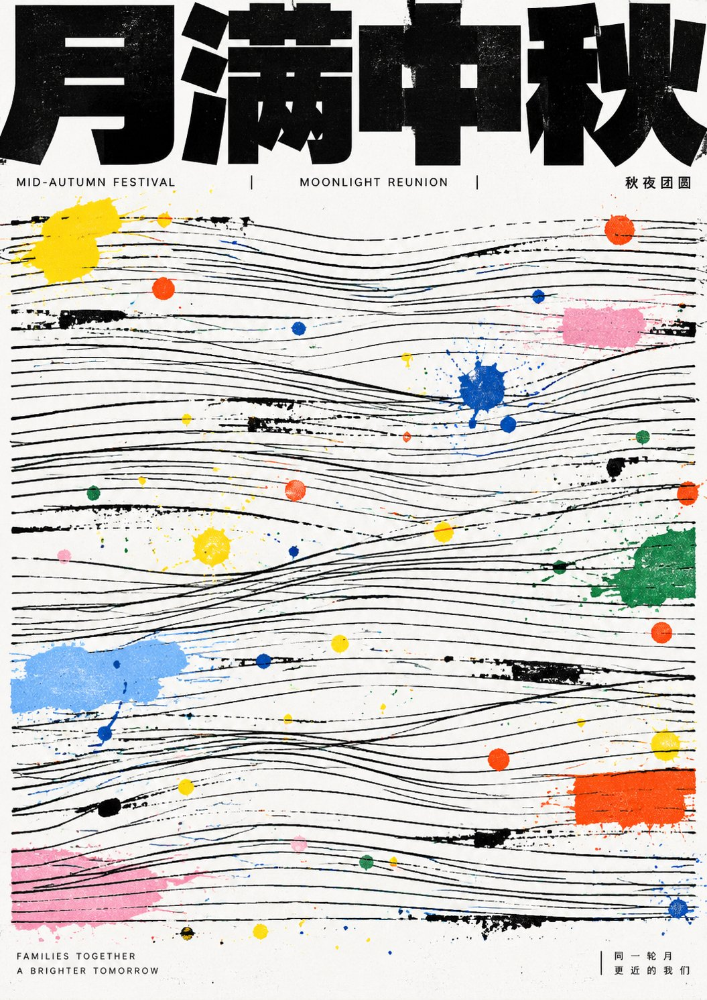

# GPT2 × 线条 × 色点 × 中秋海报

- **日期**: 2026-09-24
- **来源**: [@xiaoxiaodong01](https://x.com/xiaoxiaodong/status/2102995246745550926)（现用户名 `@xiaoxiaodong`）
- **Tweet ID**: `2102995246745550926`
- **模型**: GPT Image 2
- **备注**: 线性细线场 + 高饱和色点泼洒的中秋主题海报 DNA；可一次衍生多张不同创意。

## 成片



## 提示词

```
让未来主题先提炼成一个可被阅读的强标题、少量信息行和一套可铺满画面的线性结构；画面第一眼必须是顶部极重、极黑、被裁切般逼近边缘的粗体字块压住下方大面积细线场，标题像建筑横梁而不是装饰字。主体图像不以写实物件出现，而被转译为多组横向、略起伏、手工错位的平行细线，线组之间有断裂、交叉、局部倾斜和不完全对齐，形成可读秩序与即兴失衡并存的底层网格。主题能量通过散落的颜料点、短擦痕和小色块介入线场，颜色采用少数高饱和原色与轻灰、浅粉、浅蓝、绿、橙并置，像印刷后被手工泼洒或误套色留下的痕迹；色点大小悬殊，既有针尖小点也有指腹般斑块，分布看似随机但围绕线的节奏产生停顿、重音和跳跃。文字系统采用极端压缩层级：主标题为厚重无衬线黑块，字形宽阔、笔画均匀、内白被压小、端点平直、连接紧密，任何书写系统都应保持块面优先和正字识别；辅助文字细窄、冷静、贴近标题或底边，作为制度化信息而非视觉主角。背景保持未装饰白纸，保留干净边界、轻微印刷生硬感和手工污点的不完美，不加渐变、阴影、摄影质感、精致插画、对称装饰或柔化美化，让黑色秩序与彩色事故共同构成主题。

——————
主题：中秋节海报

一共10张
每张都是不同的基于这个美学dna的不同创意
```

## 归属

原文与成图来自 [@xiaoxiaodong01](https://x.com/xiaoxiaodong)（小小东，现用户名 `@xiaoxiaodong`）。本仓库仅作个人归档，不主张原创权。
