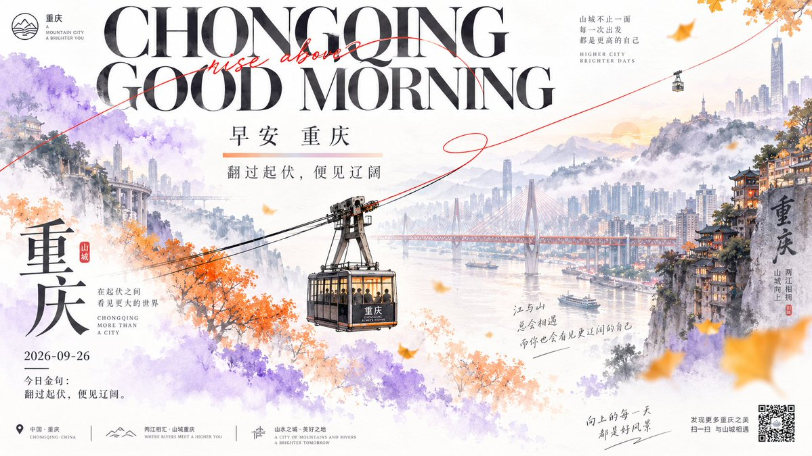
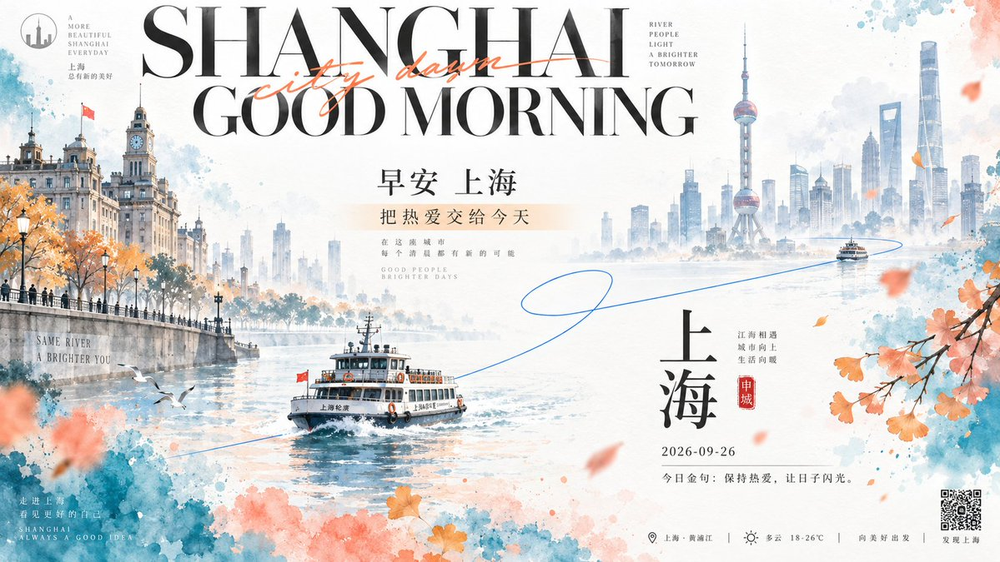

# GPT2 × 早安 × 美学提示词 × 旅游城市

- **日期**: 2026-09-26
- **来源**: [@xiaoxiaodong01](https://x.com/xiaoxiaodong/status/2103664631294448045)（现用户名 `@xiaoxiaodong`）
- **Tweet ID**: `2103664631294448045`
- **模型**: GPT Image 2.5
- **备注**: 水墨留白 + 水彩色块 + 动态曲线的十城早安旅游海报 DNA；提示词取自推文指向的 [ChatGPT 分享](https://chatgpt.com/share/6ab725cb-0674-83ea-b6c1-b9d5e22c8338)。

## 成片




## 提示词

```
Build a bright, low-muddiness ink-wash and modern promotional design around any theme object, with large areas of breathing space. Let a nearly white paper field first create roughly sixty percent quiet empty space; use extremely pale ink lines, pencil-gray rubbed washes, and misted light gray to outline layered distant scenery, with landscape elements reaching inward from the edges while the center remains a bright white passage that feels passable. Separate foreground and background through overlap, scale shifts, and transitions from solid to void, without heavy shadows overall. Translate theme-derived visual imagery into irregular watercolor color masses, using wet-on-wet blooming, granular spray, wet-dry contact, and feathered fuzzy edges; larger color masses should answer one another from the left middle, lower edge, and right edge, while the color never fills the contour completely, leaving paper-white holes and local breaks. Set one extremely thin, continuous, vivid theme-accent curve entering from outside the frame, crossing lettering and scenery, forming one relaxed loop in the blank space, then leading into the distance with a long arc; the line both links the reading sequence and creates lightweight speed, and it must run through the composition intact rather than becoming scattered decoration. Place two large-and-small theme-related dynamic symbols along the curve, shaping direction with simple black-and-white silhouettes, soft airbrushed particles, and one small relatively warm focal accent; the larger symbol skims through the scenery near the lower middle, while the smaller symbol hangs at the far end to create distance. Scatter a small number of softly focused color flakes as well, keeping density varied. In the upper area, form the main title from two lines of oversized high-contrast serif display lettering, with broad glyph faces, tight line spacing, and some parts approaching the image edge; a slender elongated slanted handwritten stroke in a more active accent color passes through the two title lines, creating an elegant conflict between glyph constructions. In the middle, use two lines of upright short copy with clear, balanced glyphs and a low-saturation light warm horizontal bar to create a pause; below and off to one side, use two enlarged theme glyphs built with high-contrast literary serif architecture, vertically staggered, paired with very small secondary copy, a date, and a narrow seal-like mark, forming a rhythm of large and small, sparse and dense, formal and informal, historical and contemporary lettering. Keep a small circular mark and concise wordmark in the upper left, and close the bottom edge with tiny practical information and a clear square identification code. Derive the color system from the theme semantics: near-white carries the largest area, two bright mid-light colors carry the watercolor blocks and form a soft cool-warm contrast, vivid monochrome is reserved only for the traveling line and very few marks, and black is concentrated in the lettering and silhouettes; the whole should be bright, clean, and soft, with saturation concentrated locally and the distant scenery reduced in contrast and chroma. The paper surface should feel light and clean, with no yellowing, stains, or heavy aging; maintain the tension among ink-wash emptiness, loose watercolor, clear typography, and the dynamic curve, and avoid making the background too solid, filling the color blocks completely, or letting the text suffocate the breathing space.


——————
主题：城市元素+早安问候+2026-09-26+今日金句+秋天元素

一共10个不同的城市，每个城市都是一个独立的美图
画幅16:9

每个图片， 不同的配色逻辑、避免雷同的构图，一眼就是不同的色相、每张都让人耳目一新
```

## 归属

原文与成图来自 [@xiaoxiaodong01](https://x.com/xiaoxiaodong)（小小东，现用户名 `@xiaoxiaodong`）。本仓库仅作个人归档，不主张原创权。
