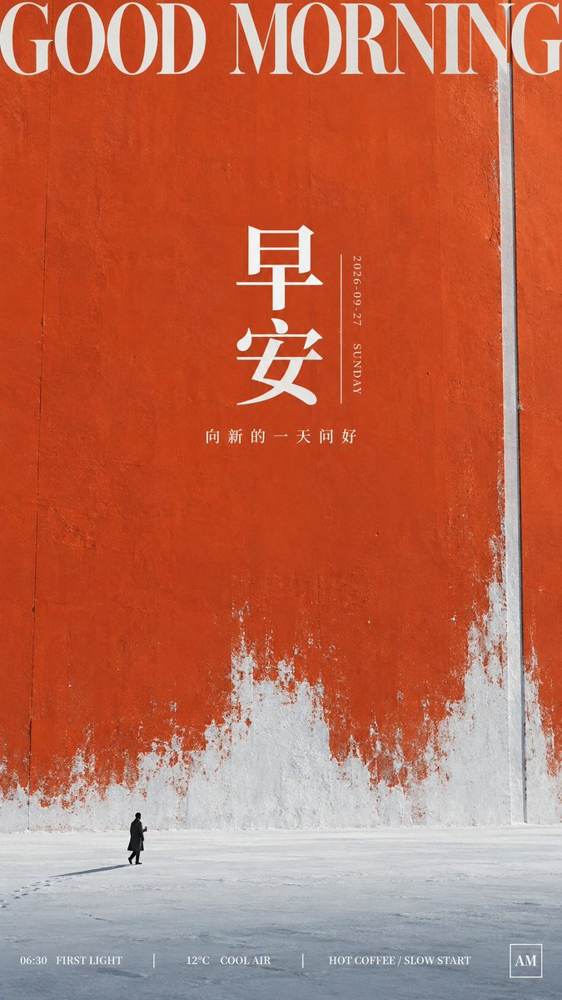

# GPT2 × 早安 × 留白 × 斑驳 × 美学提示词

- **日期**: 2026-09-28
- **来源**: [@xiaoxiaodong01](https://x.com/xiaoxiaodong/status/2104366783474102646)（现用户名 `@xiaoxiaodong`）
- **Tweet ID**: `2104366783474102646`
- **模型**: GPT Image 2.5
- **备注**: 纪念碑尺度色场 + 清寒留白 + 斑驳磨蚀边缘的竖版早安海报 DNA；今日主色取 Claude 橙；提示词取自推文指向的 [ChatGPT 分享](https://chatgpt.com/share/6ab9b320-4b08-83ea-a490-2a30c8110f18)。

## 成片



## 提示词

```
围绕任意主题对象构成具有纪念碑尺度感与清寒疏离感的视觉海报。让主题派生的巨大实体或抽象表面成为压倒性的单一色场，几乎覆盖全部空间并延伸出边界，表面保留真实墙体、厚纸涂层或哑光颜料般的微妙起伏、纵向擦痕、局部深浅和少量接缝，整体平整克制，不做均匀噪点。下缘以高明度、低饱和的洁净浅色区域托住画面，并使浅色向巨幅色场上方不规则侵蚀：靠近交界处形成细碎颗粒、飞溅、磨蚀、粉末堆积与渐疏的雾状边缘，中央局部侵入更深，其余大面保持完整，制造寒冷地表与被擦除颜料并存的联想。将一个由主题派生的微小具象尺度标记安置在下缘附近，轮廓完整、动作收敛、暗部清晰，与巨大色场形成极端体量反差；周围保留大片空旷浅地，使其显得孤独、安静而非戏剧化。色场一侧允许被窄而笔直的浅色通道或结构缝隙切开，以远近压缩和遮挡强化建筑般的压迫感，同时维持主色场的统治力。配色从主题语义与情绪温度中派生：选择最能代表主题的高饱和中深色作为绝对主色，浅色留白维持明亮、洁净、偏冷的光感，深色只集中在微小尺度标记和少量纹理，次要色仅作轻微温度偏移；主题变化时始终保持大面积纯强色、明净浅色地面、极少深色焦点的面积秩序，形成强明暗断差与清醒克制的情绪。顶部以超大高对比衬线西文横排标题横跨宽度，字距舒展，贴近边缘并允许轻微裁切；中央以两到四个大号中文宋体骨架字组成凝练标题，细横粗竖、锐利三角收笔、字面端正，旁侧配极细小的纵排日期或外文，形成宏大与纤细的密度反差。标题下方只保留短小居中的辅助文案，下缘设置一条低对比微型信息带，右下角放紧凑方形识别标记；所有文字使用浅色，保持严格轴线、宽松留白和由顶部大标题、中央中文、微小主题标记、底部信息依次下行的阅读节奏。整体采用哑光、低反光、被风雪与颜料自然作用过的真实表面，边缘磨蚀集中在色场与浅地交界，顶部和中央保留较洁净的纯色区，避免全面做旧、杂乱装饰、霓虹渐变和商业摄影式光泽。


——————
主题：早安 + 2026-09-27
补充：出现 3 个相关信息点，保持商业海报可读
画幅：竖版 9:16
```

## 归属

原文与成图来自 [@xiaoxiaodong01](https://x.com/xiaoxiaodong)（小小东，现用户名 `@xiaoxiaodong`）。本仓库仅作个人归档，不主张原创权。
