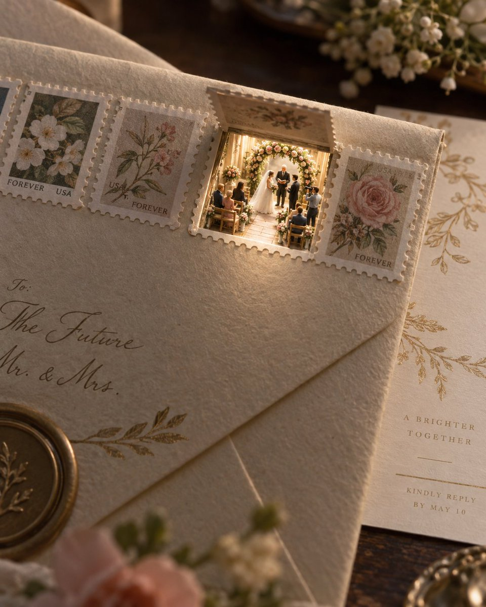

# Luna × 婚礼邀请函 × 小窗微型场景提示词

- **日期**: 2026-09-28
- **来源**: [@xiaoxiaodong01](https://x.com/xiaoxiaodong/status/2104570921105416589)（现用户名 `@xiaoxiaodong`）
- **Tweet ID**: `2104570921105416589`
- **模型**: GPT Image 2 / ChatGPT Luna（提示词由 Luna 生成）
- **备注**: 熟悉物件开一小窗、露出微缩活动空间的婚礼邀请函创意；完整英文提示词写在原帖正文。

## 成片



## 提示词

```
Open one structural part of a familiar object to reveal a brightly lit miniature activity space that shares its outer contour, as though another scale of existence were concealed inside. Small-scale participants actually use this part, allowing the same form to read both as an ordinary component and as something with a different purpose. Build around one oversized carrier, one site of functional transformation, and a subordinate group of scale witnesses. Keep the carrier recognizable, with convincing joins, thickness, and occlusion at the transformed part; placing tiny objects beside it is insufficient. Let the appended subject determine the carrier, the miniature activity, its supporting details, and the materials. Give abstract ideas a tangible carrier and visible actions; with no appended content, choose a coherent pairing whose structure enables its new use. Use Gestalt similarity to establish a rhythm from the carrier’s inherent repeated features, then change the function of just one part. Frame within a frame gathers intricate detail inside the small opening. Asymmetrical balance places a broader dark mass to the left and a lighter projecting mass to the right, keeping the whole stable around the middle; the arrangement may be mirrored as a whole. Place the activity core below the center, let the carrier extend beyond the top and side edges, and keep the event group near three-fifths of the frame width and half its height. About half the image should remain quiet in contrast and narrative density. Unify the full frame through the appearance of close-range photography of a physical miniature, viewed near the height of the activity with restrained perspective. Small models retain simplified sculpting, painted edges, and limited detail; the carrier’s tangible surface contrasts with the delicate work at the transformed part. Keep the core and surrounding recognition cues readable rather than erasing scale evidence with heavy blur. Derive hues from the content and its materials. Hold roughly three-quarters of the frame in subdued, low-chroma middle-to-dark values, gathering several vivid color notes in the small brightest area. Keep the surroundings slightly warm and the inner light clearer and more neutral, with only a mild temperature difference. Light spills outward from within the transformed part onto adjacent edges and receptive surfaces, falling off with distance while firm contact shadows remain. Broad diffuse reflection contrasts with small translucent details and tiny specular highlights; retain detail in the lit area. Allow subtle photographic grain and minute imperfections in model surfaces while keeping the bright area clean, without an overall distressed finish. Use no standalone headline. Any markings inherent to the carrier enlarge with it, using solid strokes with low contrast in stroke thickness, normal character width, and steady baselines. They obey perspective, lighting, and occlusion; complex glyphs retain clear counters, and markings are omitted when the content does not call for them. If appended copy needs a note, place it near the middle of the lower edge as a very small, loosely spaced single line, with one slightly heavier segment and one finer segment, its character height about one-sixth that of surface markings. Do not invent attribution. Later subject, wording, use, palette, and canvas instructions take precedence while structural reuse, a single functional transformation, extreme scale contrast, and a small bright concentration of detail supported by broad quiet areas remain fixed.

theme: Wedding Invitation Card
```

## 归属

原文与成图来自 [@xiaoxiaodong01](https://x.com/xiaoxiaodong)（小小东，现用户名 `@xiaoxiaodong`）。本仓库仅作个人归档，不主张原创权。
