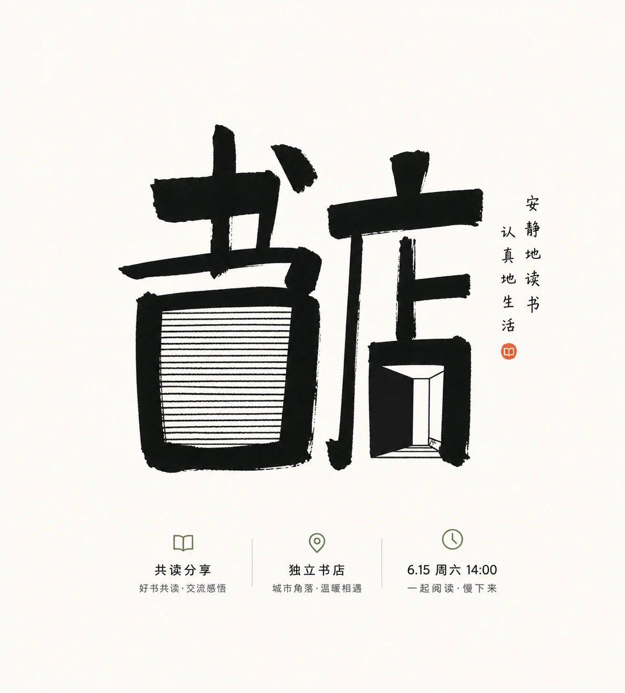

# 中文字体 × 手写字形主视觉提示词

- **日期**: 2026-10-03
- **来源**: [@xiaoxiaodong01](https://x.com/xiaoxiaodong/status/2106203619423047908)（现用户名 `@xiaoxiaodong`）
- **Tweet ID**: `2106203619423047908`
- **模型**: 未标明
- **备注**: 作者自评「中文字体方面最优意思的提示词之一」；完整 copy-pasteable 手写字形主视觉提示词 + 独立书店阅读活动成片示例。

## 成片



## 提示词

```
围绕任意主题对象生成一枚手写字形主视觉：把主题名称、核心符号或关键信息压缩成少数字形单元，整体集中在画面中心区域，四周保留大量安静空白，让第一眼先读到厚重黑形，再读到内部细线的手工速度。主形体使用粗黑笔触构成，边缘保留手写时的轻微歪斜、断口、墨量不均和切割感，笔画不要圆润修饰；其中一个主要字形或符号被处理成外框厚重、内部由多条水平细线拉紧填充的结构，细线长短略有差异，像被压缩的层叠纹理，形成粗块与细线、实墨与空隙之间的张力。背景作为高明度干净底场，面积占绝大多数，通风感明确；色彩从主题自身的材质、情绪和文化语义中提取，但遵循大面积明亮洁净底色、少量高对比结构色、极少强调色的角色映射，保持清透安静、明度高、饱和度受控、边界清楚，深色只承担信息和骨架重量，不把画面做旧、做脏或变成复古纸感。整体呈现像一次快速但有判断的手绘字体实验，信息少、力度集中、空白有压迫感，完成品应有真实毛边和笔触停顿，而不是印刷字体、装饰花纹或普通书法。

——————
主题：独立书店阅读活动的主题字形主视觉，传达安静、亲近且具有文化感的活动气质
补充：出现 3 个相关信息点
画幅：竖版 9:10
```

## 归属

原文与成图来自 [@xiaoxiaodong01](https://x.com/xiaoxiaodong)（小小东，现用户名 `@xiaoxiaodong`）。本仓库仅作个人归档，不主张原创权。