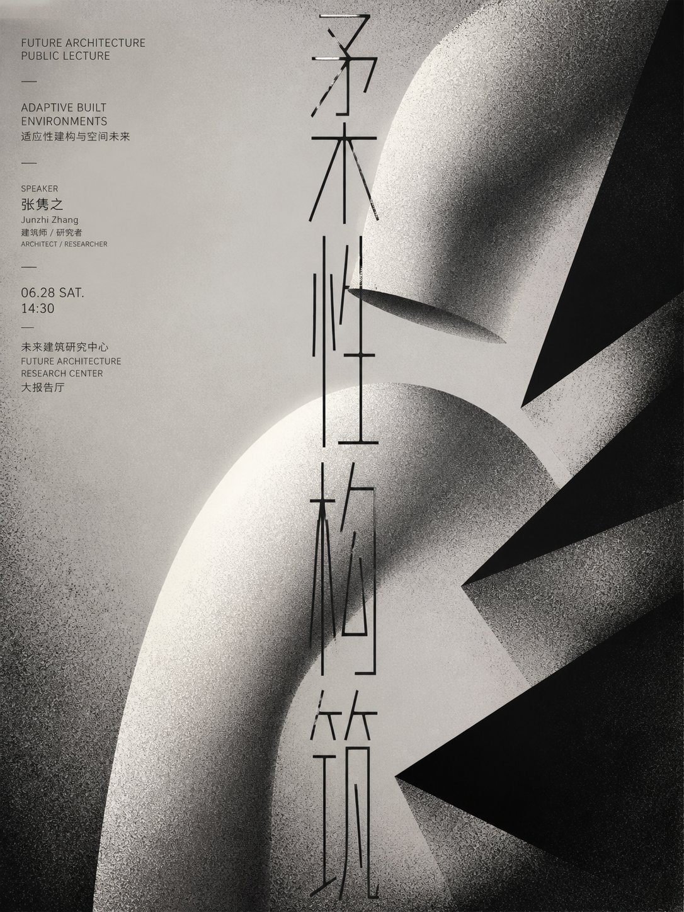
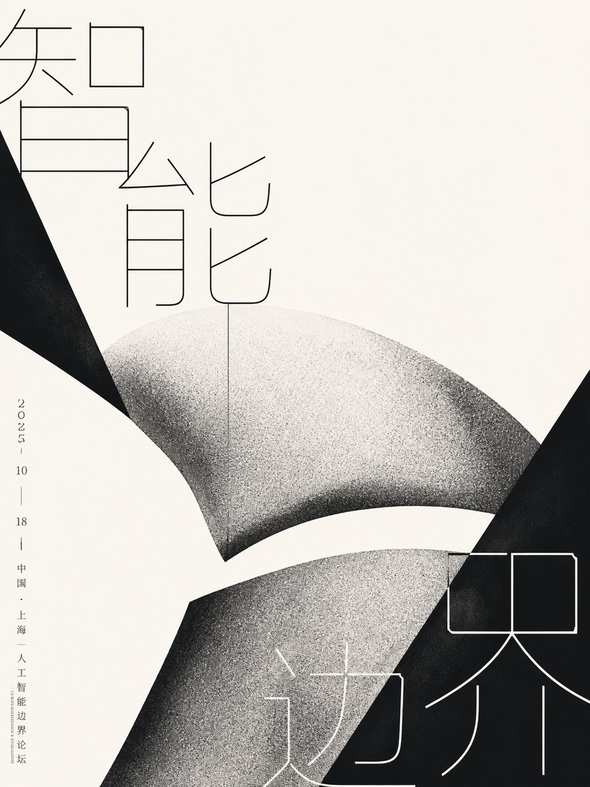

# GPT2 × 字形穿插 × 实验 × 美学提示词

- **日期**: 2026-10-06
- **来源**: [@xiaoxiaodong01](https://x.com/xiaoxiaodong/status/2107280057450590665)（现用户名 `@xiaoxiaodong`）
- **Tweet ID**: `2107280057450590665`
- **模型**: GPT2（GPT image 2）
- **备注**: 完整 copy-pasteable「柔性体块 × 超尺度细字骨架 × 黑色切面」单色实验印刷风海报提示词 + “智能边界”论坛海报落地示例；附 2 张成片。

## 成片





## 提示词

```
第一眼形成“巨大柔性体块被超尺度字形与锐利黑色切面共同夹持”的强烈事件：依据未来主题提炼一个圆钝、拱起或弯折的核心形体，将其拆成上下错位且彼此呼应的两段，占据画面中央并主动越界裁切；以纯黑几何楔面从边角斜向切入，在留白中制造紧张的包围、遮挡与方向推力。把目标文字重构为极细至中等粗细、近乎单线性的无衬线视觉骨架，保持正字识别与正常阅读方向，同时拉大字腔、开放端点、克制连接处，让不同字符疏密错落地跨越形体、压住轮廓或被局部遮挡；文字不是说明栏，而是与形体同级的结构梁，字符间允许尺度突变、基线错位和边缘裁切，但不得变成难辨的装饰符号。全局仅用暖白、深黑与颗粒灰，灰色形体通过密集黑白噪点、喷粉般网点和边缘积墨形成由亮心向暗边的粗粝明暗塑形，不使用彩色、光泽、摄影质感或顺滑数码渐变。保留大片不均衡负空间，让圆钝体、尖锐切面、纤细字杆三种形态相互穿插；边缘可有轻微印刷渗散和颗粒抖动，整体像实验性单色印刷成品，冷峻、抽象、克制，拒绝居中规整、完整展示、装饰性美化与精致抛光。

——————
做成人工智能边界论坛主题海报，画面文字为“智能边界”，采用暖白大底、炭黑切面与银灰颗粒体的高明度无彩关系；核心形体压在右下并向左上反折，左侧形成狭长上升路径，右上保留大块空白；标题拆成跨越上下边缘的超大细字骨架，日期与地点沿左缘小号纵向对齐。画幅为竖版 3:4。
```

## 归属

原文与成图来自 [@xiaoxiaodong01](https://x.com/xiaoxiaodong)（小小东，现用户名 `@xiaoxiaodong`）。本仓库仅作个人归档，不主张原创权。
