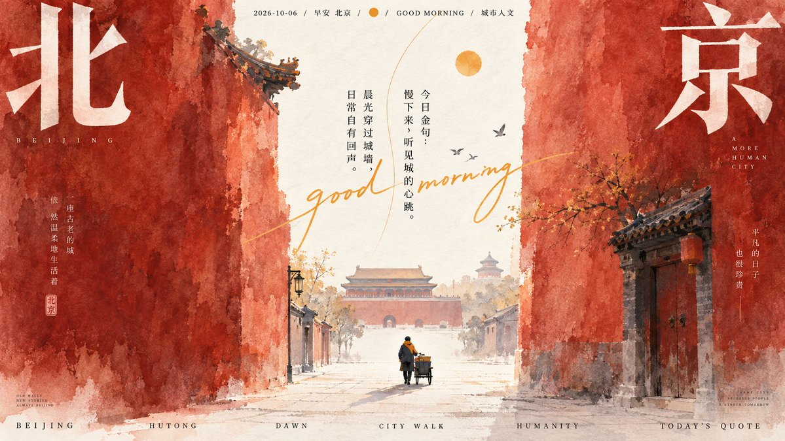
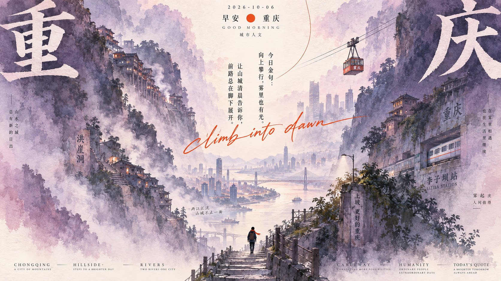
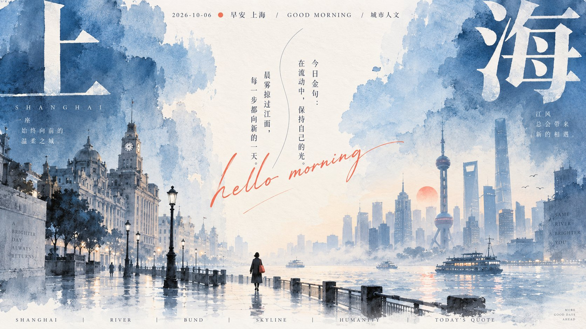

# GPT2 × 早安 × 人文 × 水墨 × 美学提示词 × 2026-10-06

- **日期**: 2026-10-07（推文标题日期 2026-10-06）
- **来源**: [@xiaoxiaodong01](https://x.com/xiaoxiaodong/status/2107644369344012451)（现用户名 `@xiaoxiaodong`）
- **Tweet ID**: `2107644369344012451`
- **模型**: GPT Image 2.5（GPT2）
- **备注**: 巨大水彩色面夹出明亮纵深通道 + 底部微小剪影 + 竖排金句与手写强调字的早安城市人文海报 DNA，一次出 10 个城市 16:9；提示词取自推文指向的 [ChatGPT 分享](https://chatgpt.com/share/6ac5a05a-f144-83e9-afde-2e7d21ba2721)。

## 成片








## 提示词

```
围绕任意主题内容，将核心意象转译为一条由巨大水彩色面夹出的明亮纵深通道：两侧高耸、近乎触边的有机块面承担主要视觉重量，轮廓像宽笔反复平刷后留下的参差边缘，内部保留深浅不匀的颜料沉积、细密纸纹与轻微干湿交界；中央浅色负空间自上而下连续贯通，宽窄缓慢变化并在下方展开成空旷地面，使视线自然沿单一纵轴下落。将主题代表物缩成底部中央附近的微小简练剪影，只保留清楚姿态与一处主题派生色，让巨物与小物的尺度反差制造安静、辽阔、略带独行感的叙事；沿通道点入少量极小的主题符号或远景痕迹，以稀疏节奏暗示深度，不抢夺留白。色彩从主题的情绪、自然属性与文化联想中提取主导色相，不固定具体色名：主色以中低饱和、中高明度的大面积粉质水彩铺陈，两侧用同色系较深与较浅层次拉开前后，中央保留温润的纸本亮色；正文与微小剪影用近黑形成清晰骨架，再从主题中派生一个鲜明、偏暖或与主色形成醒目色相距离的高饱和强调色，仅用于一个圆点和一笔细长手写字迹。整体维持高调、通透、清新洁净的色彩情绪，主色覆盖绝大部分，浅色通道形成稳定光区，强色只作极少跳点；无戏剧性光束，亮度来自纸面留白与透明颜料的层层吸收。文字建立跨尺度的编辑节奏：主题最关键的两个中文字符拆开放大，分别压在上方左右边缘，使用细横粗竖、锐利收笔的高反差字形；顶部以小号中文、细衬线外文和一个彩色圆点组成疏朗说明行；核心文案收窄成两列竖排，置于中央通道中段，字距略松，并让一条纤细弧线从上方牵引视线。以强调色的自由连写字横穿竖排文字和浅色空间，笔势轻快、局部遮叠但不破坏中文可读性，形成严谨印刷字与私人手迹的情绪碰撞。底部沿边缘分布多组大写细衬线外文，字号小、字距宽、行距紧，词组之间留出明显空隙，部分文字贴近边界以压住画面。所有文案都从当前主题提炼，保留中外文字级差、竖排与横排交叉、角落大字对中央小景的呼应。媒介表现为吸水纸上的水彩与薄层水粉，边缘有自然羽化、局部干刷颗粒和轻微扫描柔化；纸面大区保持干净，仅在颜料内部及通道下方出现少量细碎缺墨感，避免均匀噪点、厚重污渍、写实摄影光影或数字渐变，以中央长径、巨大色面、微小剪影和手写强调的关系锁定整体辨识度。

——————
主题：城市元素+早安问候+2026-10-06+今日金句+城市人文元素
一共10个不同的城市，每个城市都是一个独立的美图
画幅16:9
每个图片， 不同的配色逻辑、构图差异，一眼就是不同的色相
```

## 归属

原文与成图来自 [@xiaoxiaodong01](https://x.com/xiaoxiaodong)（小小东，现用户名 `@xiaoxiaodong`）。本仓库仅作个人归档，不主张原创权。
