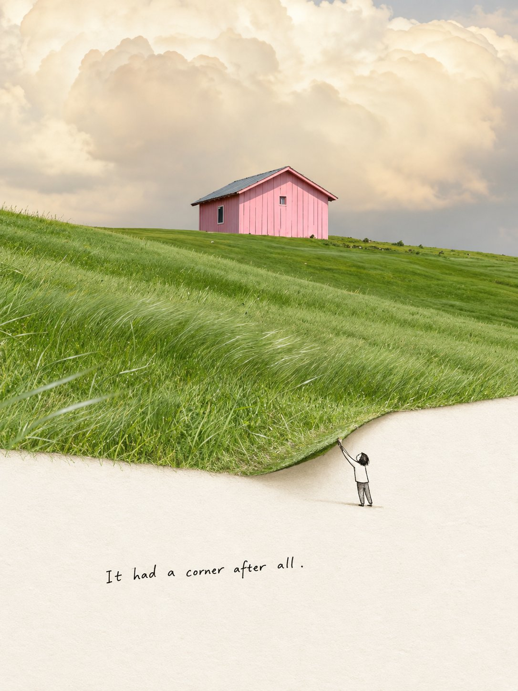
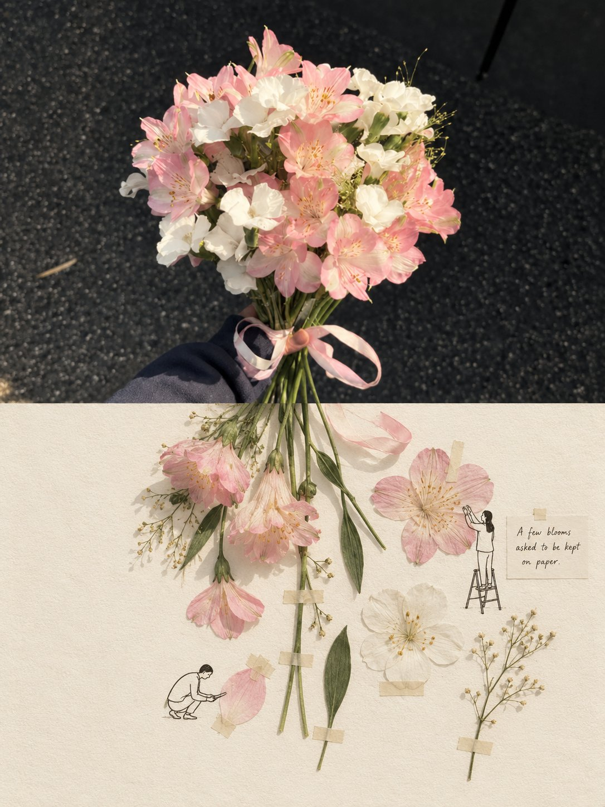

# GPT2 × 拓展 × 第二世界 × 美学提示词 × VOL.341

- **日期**: 2026-10-09
- **来源**: [@xiaoxiaodong01](https://x.com/xiaoxiaodong/status/2108227862390280585)（现用户名 `@xiaoxiaodong`）
- **Tweet ID**: `2108227862390280585`
- **模型**: GPT2（GPT image 2）
- **备注**: 完整 copy-pasteable「第二世界」破框摄影插画提示词（上传摄影作品 → 上下 1:1 现实/越界转译）+ 2 张成片；灵感来自小红书博主 Vaeen Ai Design。

## 成片





## 提示词

```
请基于我上传的每一张摄影作品，分别创作一张独立的 3:4 竖版「第二世界」概念性超现实摄影插画海报，每张单独输出，不拼图。整体上下 严格 1:1。上半部分是原始现实照片，下半部分是从照片内部生长出来的另一层空间；二者不是上下拼接，而是同一个瞬间在不同叙事层中的连续存在。
上半部分尽可能忠实保留原照片，不改变主体、动作、空间关系、光线、色彩与真实质感，只做必要的等比裁切与轻微高级调性整理，使其具有干净、克制、独立出版物般的摄影品质。
创作重点不在“题材”，而在视觉结构的再理解。先观察这张照片中最具决定性的结构线索，例如边界、坡度、水面、倒影、阴影、裂缝、道路、枝条、云层、轮廓、空隙、流向、重复节奏、空间转折或人物姿态；从中找到最适合被“越界”的那个部分。然后让它突破照片边界，进入下半部分，并在进入后发生用途、尺度、语义或叙事角色的转译。不是简单延长，而是让现实中的某种东西，在第二层空间里变成另一种可以被使用、进入、测量、打捞、修补、整理、借用、展开或收藏的存在。
下半部分是温暖、安静、带细微纸张肌理的暖米白空间，保留充足留白。它不是插画背景，也不是装饰区，而是承接“越界之后的新逻辑”的地方。上下关系应符合：现实 → 越界 → 转译。画面的趣味来自一个聪明而准确的跨层叙事，而不是可爱装饰。
可加入极简黑色手绘线稿人物，但应少而准，0–3 个即可。人物不是摆设，而是第二世界的使用者；他们必须与被转译出的结构发生真实互动。线条轻、简、自然，略带手工感，不卖萌，不复杂，不喧宾夺主。动作应具体、克制、聪明，像是在认真处理一件本来就存在于这个世界里的小事。
可加入一句简短英文手写旁白，但必须根据这张图里真实发生的“第二世界事件”现场生成。语气像顺手写下的发现或轻声旁白，带一点幽默和余味，不写成励志句，不解释寓意，不套模板。
整体风格应呈现：Mixed-Media Photo Illustration、Surreal Photomontage、Frame-Breaking Illusion、Trompe-l'œil、Visual Metaphor、Conceptual Editorial Illustration 的综合质感。也就是：以跨媒介拼贴为形式，以画面越界为机制，以视觉隐喻为核心，以温柔、轻微、聪明的微型超现实主义为情绪基调。
不要做成“照片下方加小人和句子”的模板图；不要只有延伸没有转译；不要只有形式没有隐喻；不要强行抒情；不要商业广告感、复杂插画感、重复动作、无依据装饰、机械拼贴、硬连接或廉价治愈风。
最终目标：
让观者先看到一张成立的真实照片，再忽然发现其中某个元素越界进入了另一层空间，并在那里获得了一个意想不到却极其自然的新意义。
不是给照片加创意，而是把照片里原本潜伏的第二种现实显现出来。
```

## 归属

原文与成图来自 [@xiaoxiaodong01](https://x.com/xiaoxiaodong)（小小东，现用户名 `@xiaoxiaodong`）。本仓库仅作个人归档，不主张原创权。
