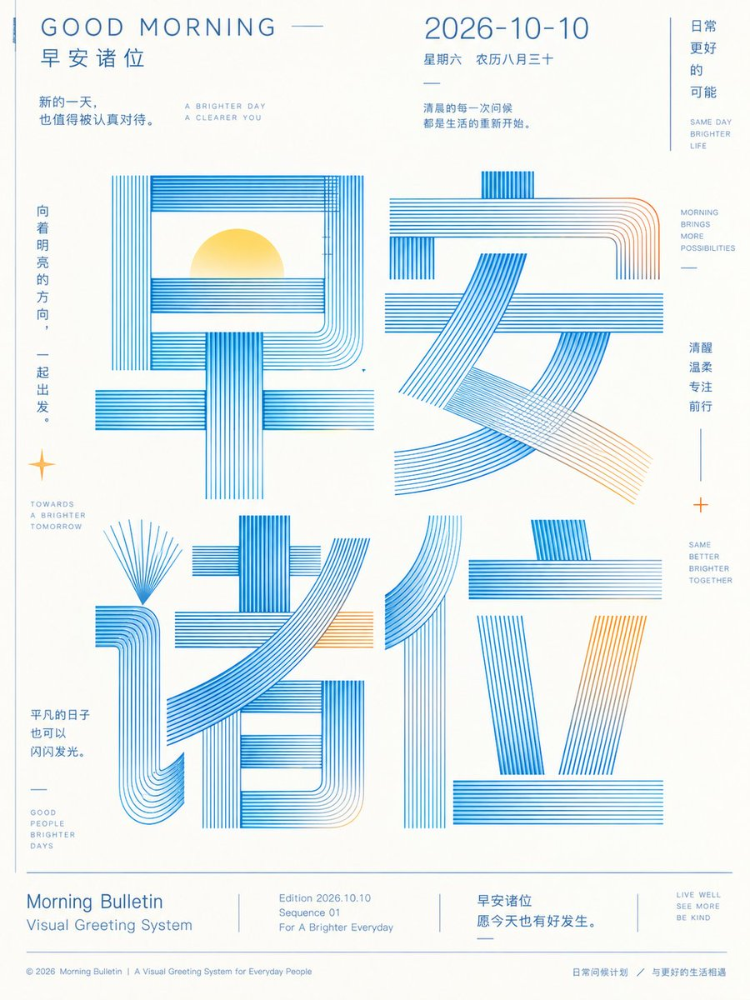

# GPT2 × 早安 × 线条字体 × 美学提示词 × 2026-10-10

- **日期**: 2026-10-10
- **来源**: [@xiaoxiaodong01](https://x.com/xiaoxiaodong/status/2108727066707583143)（现用户名 `@xiaoxiaodong`）
- **Tweet ID**: `2108727066707583143`
- **模型**: GPT2（GPT image 2）
- **备注**: 完整 copy-pasteable 巨型线描字形信息图提示词（主题可替换）+ 1 张成片；提示词取自帖内 ChatGPT share；会员硬广段未收录。

## 成片



## 提示词

```
围绕任意主题内容生成一张明亮洁净的信息型图像：让主题被转译成超大尺度的字形或符号主结构，主结构占据画面中段并成为第一视觉，使用细密、平行、均匀的线描来塑造笔画厚度、转折和内部空间，部分笔画以开放轮廓、放射状线束、竖向密排线和横向层线形成机械般精确的节奏；字形之间可分层堆叠或跨行连接，底部以极细水平线建立秩序，上方和边缘放置少量小字号信息，使阅读路径从醒目的图形标题进入清晰的说明层。背景保持大面积高明度留白，边距通风，信息密度克制，所有文字和装饰线都要像印刷网格中的精密部件，边缘锐利、无厚重阴影、无复杂插画填充。色彩从主题自身的材质、文化信号与情绪中提取并映射到固定角色：背景承担明亮透明的基础场，主结构使用清晰冷静的结构色，局部笔画与小信息层使用少量主题派生强调色，保持大面积浅底、少量高饱和点缀、干净色阶和明确明度差，让整体呈现清透、轻快、精确的情绪；即使主题需要更深色，也必须保持色面干净、线条发光般清晰、留白充足。最终效果应像出版物或展览视觉系统的核心版面，依靠巨型线描字形、极细信息排版和高明度色彩秩序制造记忆点，而不是依靠具象场景或装饰性插画。 主题：早安诸位 背景逻辑：2026-10-10 比例：3:4
```

## 归属

原文与成图来自 [@xiaoxiaodong01](https://x.com/xiaoxiaodong)（小小东，现用户名 `@xiaoxiaodong`）。本仓库仅作个人归档，不主张原创权。
